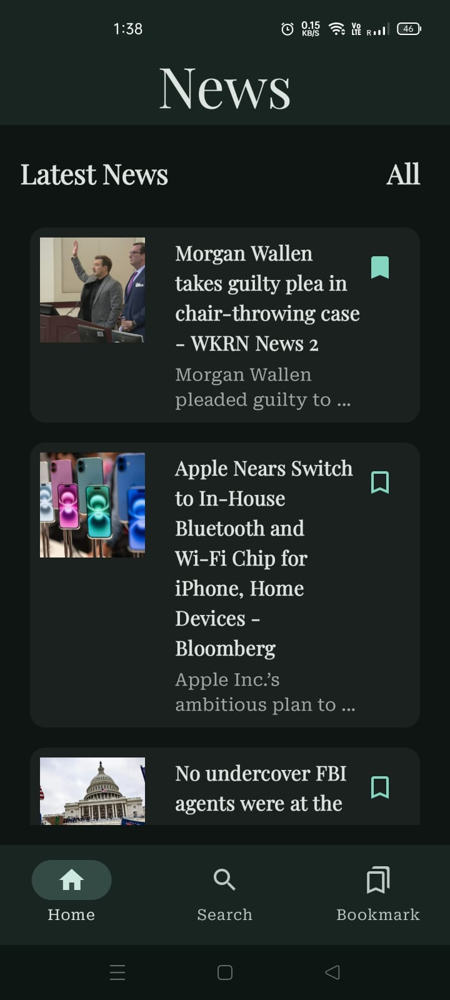
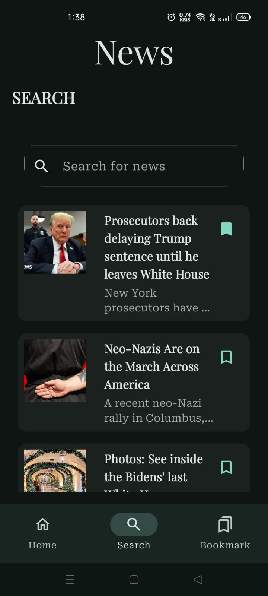
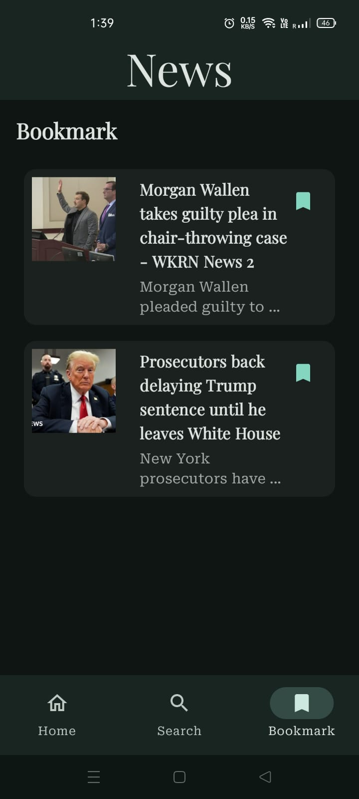

# News Application

## Overview
Welcome to the News Application! This is a modern and easy-to-use Android app built with Kotlin and Jetpack Compose. It’s designed to keep you up-to-date with the latest news articles, help you find news that matters to you, and save your favorite articles to read later—even when you’re offline. 

## Features
- **Browse News by Category:** Quickly jump to topics like Technology, Sports, Business, and more.
- **Search Articles:** Find exactly what you’re looking for with a powerful search feature.
- **Save for Later:** Bookmark articles to read offline anytime.
- **In-App Reading:** View full articles without leaving the app using a built-in WebView.
- **Offline Mode:** Access your saved articles even when you’re not connected.
- **Sleek and Modern UI:** Built with Jetpack Compose for a clean and interactive experience.

## Screens
1. **Home Screen:** See news organized by categories at a glance.
2. **Search Screen:** Type in keywords to find specific news articles.
3. **Bookmark Screen:** Manage your saved articles in one convenient place.
4. **WebView Screen:** Open and read full articles directly within the app.

## Technologies Used
### Programming Language
- Kotlin

### Frameworks and Libraries
- **Jetpack Compose:** Makes UI development fun and flexible.
- **Room Database:** For saving bookmarks locally.
- **ViewModel and LiveData:** Keeps your app’s data stable and responsive.
- **Navigation Component:** For smooth transitions between screens.
- **WebView:** To display full news articles.
- **Retrofit & OkHttp:** Handles fetching data from the NewsAPI.
- **Coroutines:** Powers smooth, fast asynchronous operations.

### Development Environment
- Android Studio (Latest Version)

## Architecture
The app uses the **MVVM (Model-View-ViewModel)** architecture:
- **Model:** Fetches and stores data—whether from the NewsAPI or your bookmarks.
- **ViewModel:** Manages data for the UI and ensures it survives configuration changes.
- **View:** Built with Jetpack Compose, this layer displays the data and interacts with users.

## How to Run the Project
1. Clone this repository:
   ```bash
   git clone https://github.com/Naitik-ag/NewsApp.git
   ```
2. Open the project in Android Studio.
3. Add your API key for NewsAPI in the `Constants.kt` file:
   ```kotlin
   const val API_KEY = "your_api_key_here"
   ```
4. Build and run the app on your emulator or device.

## Screenshots## Screenshots

### Home Screen


### Search Screen


### Bookmark Screen


### WebView Screen


## Future Enhancements
Here’s what’s coming next:
- Notifications to alert you about breaking news.
- Personalized news feeds based on your preferences.
- Sync your bookmarks across devices by logging in.
- Multi-language support for global accessibility.
- Enhanced offline support, including images and more.

## Contributing
Contributions are welcome! Here’s how to get involved:
1. Fork this repository.
2. Create a new branch for your feature:
   ```bash
   git checkout -b feature-name
   ```
3. Make your changes and commit them:
   ```bash
   git commit -m "Description of feature"
   ```
4. Push your branch:
   ```bash
   git push origin feature-name
   ```
5. Open a pull request, and we’ll take a look.

---
Thanks for checking out the News Application. Dive in, explore, and feel free to contribute!
